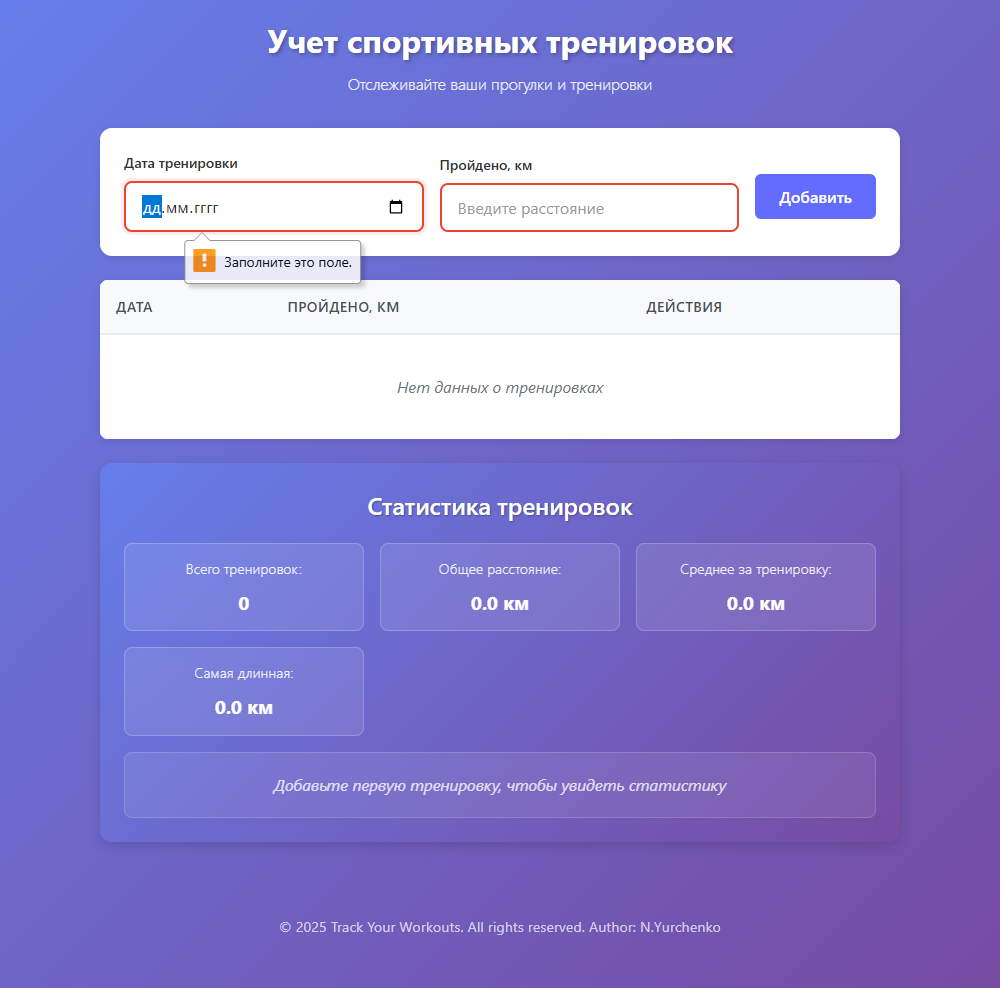
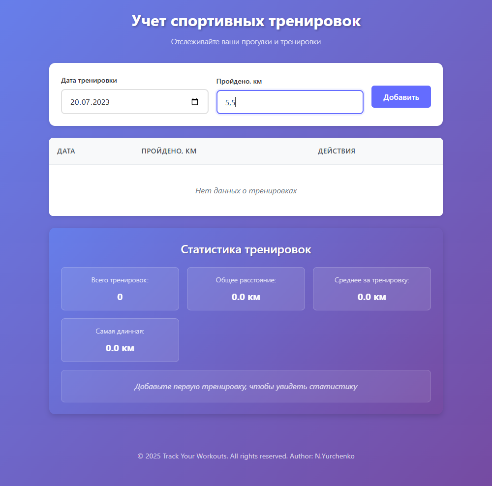
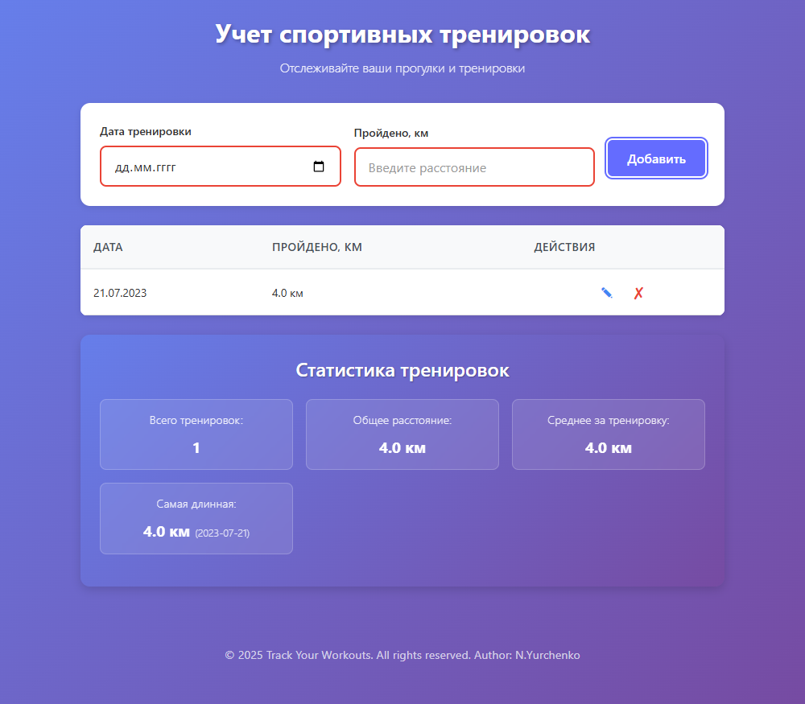

## Steps Sports Training - Приложение для учета тренировок и прогулок


[Деплой](https://nmyurchenko-max.github.io/ra-form-steps/)

---

### Описание проекта

Приложение предназначено для учета спортивных тренировок и прогулок. Позволяет добавлять, редактировать и удалять записи о тренировках с указанием даты и пройденного расстояния. Данные сохраняются в localStorage и отображаются в таблице с возможностью просмотра статистики.

---

### Технологии и инструменты

- React
- TypeScript
- Vite (сборщик и дев-сервер)
- Cypress (E2E тестирование)
- ESLint, Prettier (стилизация кода)

---

### Структура проекта

Подробная структура проекта и документация доступна в [DOCUMENTATION.md](./DOCUMENTATION.md)

---

### Основные компоненты

- **StepsForm** — форма для ввода и редактирования данных тренировок
- **Button** — универсальная кнопка
- **Input** — универсальный компонент ввода
- **Icon** — иконки для действий (редактирование, удаление)
- **Table** — таблица для отображения списка тренировок
- **TableRow** — отдельная строка таблицы с данными
- **Modal** — модальное окно для подтверждения действий или редактирования
( не используется в приложении)

---

### Особенности реализации

- Данные о тренировках хранятся в формате ISO (YYYY-MM-DD) для корректной сортировки и обработки
- В UI дата отображается в локальном формате ДД.ММ.ГГГГ для удобства пользователя
- Ввод расстояния разрешает любые символы, но с валидацией на положительное число
- При добавлении записи с существующей датой расстояния суммируются
- Поддержка редактирования и удаления записей
- **Сохранение данных в localStorage** - реализовано в компоненте App.tsx:
  - Автоматическая загрузка данных при монтировании компонента
  - Автоматическое сохранение при каждом изменении данных
  - Данные сохраняются в формате JSON под ключом 'stepsData'
- Реализовано E2E тестирование с Cypress с автоматическим созданием скриншотов и логированием

---

### Использование

#### Запуск проекта

1. Клонируйте репозиторий

2. Установить зависимости:
```bash
yarn install
```

1. Запустить дев-сервер:
```bash
yarn dev
```

1. Открыть в браузере:
```
http://localhost:5173/ra-form-steps/
```

---

### Тестирование приложения

- Cypress настроен для E2E тестов
- Скрипты для запуска тестов добавлены в package.json:
  - `yarn test` — запуск всех тестов
  - `yarn test:open` — интерактивный режим
  - `yarn test:e2e` — запуск конкретного теста
- Автоматическое создание папок для скриншотов, видео и загрузок
- Логирование тестов в консоль

### Тестируемые функции:

✅ Валидация формы


✅ Добавление тренировок



✅ Редактирование записей  



✅ Удаление тренировок


✅ Отображение даты в формате ДД.ММ.ГГГГ

✅ Отображение данных из localStorage при перезагрузке страницы


✅ Сброс формы при нажатии на кнопку "Отмена"


✅ Корректная работа

---

#### Контакты

Автор: N.Yurchenko  
Email: NMYurchenko@outlook.com, yurch-nina@yandex.ru
GitHub: https://github.com/NMYurchenko-max/


---

#### Лицензия

[ISC License](LICENSE)

#### Дополнительные материалы

- [Cypress](https://www.cypress.io/)
- [React](https://reactjs.org/)
- [TypeScript](https://www.typescriptlang.org/)
- [Vite](https://vitejs.dev/)

---
